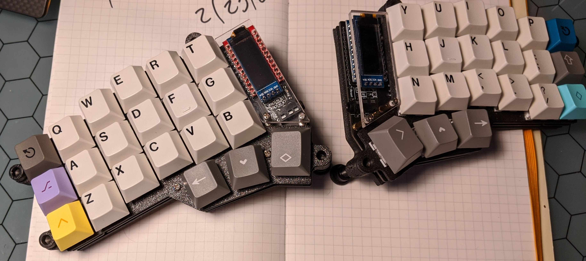
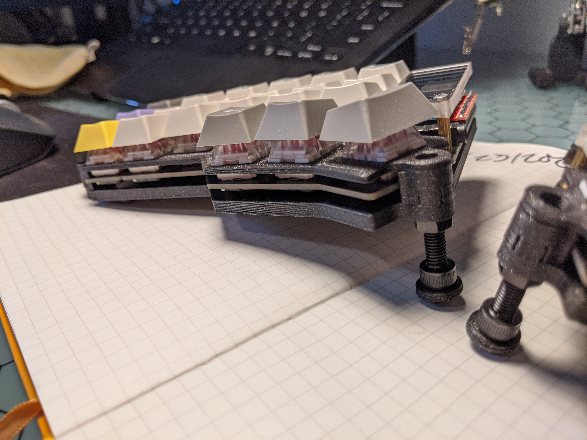

# Poor Mans Tented Corne



Corne case that uses M5 screws to tent

## Assembly

To pint this case you will need to print the following:
+ 8 x Corne_M5_Spacers.stl
+ 4 x Corne_Foot.stl (optional but recommended)
+ M5 Nuts andScrews

### Screw Patterns

Outside :

```
    v   --> Screw head
    |
    _   --> Switch Plate
    #   --> Nut (in recessed spacer)
    _   --> Base plate
```

Inside (raised) :

```
    _   --> Switch Plate
    #   --> Nut (in recessed spacer)
    _   --> Base plate
    #   --> Nut
    |
    ^   --> Screw Head
    l   --> Foot (placed in screw head)
```

> Note : The outside feet actually just use the bottom of the board to stand up.  You can use the following rubber stick on feet to provide a proper base (also used for feet on tented posts): <https://www.amazon.com/gp/product/B06XCLYL53/ref=ppx_yo_dt_b_asin_title_o00_s01?ie=UTF8&psc=1>

Example of outside screw pattern
